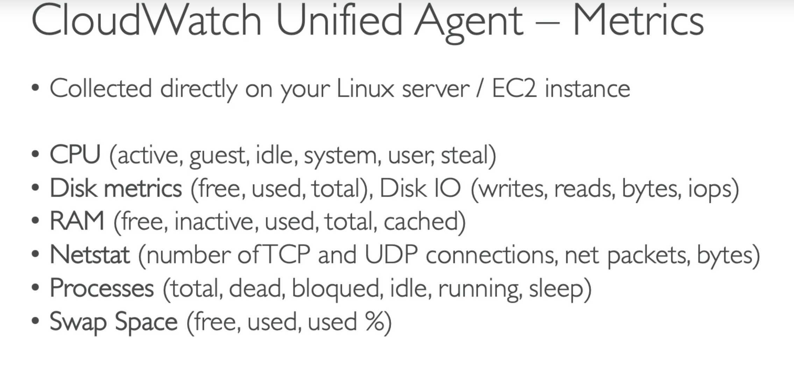

## AWS Sertified Developer exam notes

#### Security tools
 - **Credential report** - generates csv-file with information abount accouts, its usage, password rotations, MFA, access keys, ...  
 - **Access advisor** - shows when some services was last used. It allows to follow least privelege principle.  

#### IAM best practices:
 - don't use root account for usual work;
 - don't share root account
 - assign users to groups and assign permissions to groups
 - create strong password policy
 - enforce using MFA
 - use Roles for EC2 instances
 - use Credendials report
 - don't share access keys

IAM Policies:
 - AWS managed
 - customer managed
 - inline

#### EBS

Storages:
 - EBS Snapshot  
 - EBS Snapshot Archive - requires 24-72 hours for extraction  

Recycle Bin - snapshot may be put into the archive (from 1 day to 1 year)  

For gp2 type IOPS and throughtput are linked (to increase IOPS, you need to increase space)  
For gp3 you can change IOPS and throughtput independently  

io2, io3 - up to 32K iops and up to 64K for Nitro EC2-instances
IOPS may be increased independently

io2 Block Express - up to 256K IOPS (1K IOPS per 1 Gb)

io* supports multi-attach! (up to 3 EC2 instances)
(application must maintain concurrent write operations)
(must use cluster aware Fs - not xfs, ext4, ...)

#### EFS
 - compatible with Linux-based AMIs  
 - POSIX file-system (NFS)
 - encryption with KMS
 - you can use security groups for access-control
 - scales automatically, pay per use

**Scale**
 - up to 1000 clients, 10+Gb per sec
 - up to 1 Pb scale

**Performance modes**
 - general purpose
 - MAX IO - more latency, more throughtput

**throughtput mode**
 - bursting mode (as more size - as more thoughtput)
 - provisioned mode - set your thoughtput

**Storage tiers**
 - Standard
 - IA (via lifecycle policy)

**Availability**
 - multi-AZ
 - one-AZ

#### ELB
**Gateway load balancer** - for filtering traffic. Uses Geneve port (6081)

**sticky sessions**
*Application based*  
 - custom cookie:  
   - You can set cookie in your EC2 instance  
   - Cookie name must be specific for each target group  
   - You can not use names: AWSALB, AWSALBAPP, AWSALBTG  
 - application cooie  
   - generated by ALB  
   - name: AWSALBAPP  
Duration-based  
 - generated by ALB  
 - name: AWSALB (AWSELB - for Classic)  

**SSL**
 - CLB provides only one SSL. You need to create an CLB for each certificate  
 - ALB provides (SNI - server name indication), therefore you can use one ALB for many domains  
 - NLB - provides SNI too  

**ASG**
Types of scaling:  
 - dynamic  
    - target tracking  
    - step scaling  
    - simple scaling  
 - predictive (AI)  
 - scheduled  

May base on:  
 - CPU utilization  
 - requests per target  
 - avg network in/out  
 - custom metric  
Scaling cooldown (ASG waits for stabilizing metrics default - 300sec)

#### EC2
To decode error messages you can use STS.
Example:
```bash
aws sts decode-authorization-message --encoded-message <message>
```

**EC2 instance metadata** - allows EC2-instances to get info about themselves.
```bash
curl http://169.254.169.254/latest/metadata

```
(run from the EC2-instance)

#### CLI
To use MFA with CLI you need to use STS GetSessionToken API
Example:
```bash
aws sts get-session-token --serial-number <ARN_OF_MFA_DEVICE> --token-code <CODE> --duration-seconds 3600
# save output

# if you don't have account - create it
aws configure --profile <NAME>

# use the saved output here
echo "aws_session_token=<SESSION_TOKEN>" >> ~/.aws/credentials
# better edit manually
```

**ThrottlingException** means that you broke the limit for requests to AWS service and you need to use exponential backoff (as an option). You need to do it only for 5** errors.

**Credentials**
Cli looks for credentials in the next order:
 - command line options (--region, --profile, ...)
 - env variables (AWS_ACCESS_KEY_ID, ...)
 - credentials file (~/.aws/credentials)
 - configuration file (~/.aws/configuration)
 - container credentials (for ECS tasks)
 - instance profile credentials (for EC2 instances)

If you want to send requests to AWS services directly (not via aws cli), you need to sign them. For it you need to use Sinature V4 protocol (sigV4).

#### ECS
IAM Role may be assigned to ECS Task (used by ECS agent). At one EC2-instance may be launched few containers with different IAM Roles

**ECS autoscaling** may be based on 
 - AWS application auto-scaling (based on metrics):
    - avg CPU utilization  
    - avg memory utilization  
    - request count per target  
 - target tracking
 - step scaling 
 - scheduled scaling

For scaling EC2 instances you can use:
 - auto scaling group
 - ECS cluster capacity provider

**Dynamic Host Port Mapping** allows to ALB send requests to ECS services with random host port (in the EC2 SG you need to allow connect to any port)

**Shared storage** - for shared data between containers in POD. For Fargate instances you have from 20 to 200Gb storage per service.

For EC2 valid:
**Task placement strategy**:
 - *Binpack*
   - place tasks based on the least available CPU or memory
   - minimizes the number of instances in use
 - *Random*
   - places tasks randomly
 - *Spread*
    - based on field you can distribute instances between AZ

**You can mix strategies together**

**Task placement constraint**
 - distinctInstance - each task should be placed on different instance
 - memberOf - place tasks on containers which satisfies an expression

**ECR**
how to login:
```bash
aws ecr get-login-password --region <REGION> | docker login --username AWS --password-stdin <AWS_ACCOUNT_ID>.dkr.ecr.<REGION>.amazonaws.com
```

exmaple of command:
```bash
docker push <AWS_ACCOUNT_ID>.dkr.ecr.<REGION>.amazonaws.com/<IMAGENAME>:<TAG>
```

#### Elastic Beanstalk
Options for update:
 - all at once (with downtime, fastest)  
 - rolling  (below capacity)
 - rolling with additional batches (longer, for prod)  
 - immutable (zero downtime, longest, quick rollback, high cost, double capacity, great for prod)  

Manually you can do:
 - Blue-green deploy
 - canary testing/releases

Beanstack can store at most 1000 versions
If you don't remove old versions, you will not be able to deploy new versions. You can set lifecycle policies to remove old versions. (current/used versions will not be deleted). Also you can keep versions in S3

**How to change type of ELB?**
After creation you can not change ELB. To change it, you need to create a new application with the some configuration, except ELB. Then you need to deploy your application to the new environment. And then you can swap urls.

**How to decouple RDS from the beanstack environment?**
 - create a snapshot
 - go to RDS settings and turn on protection from deletion
 - create a new eb environment without DB
 - make a swap urls
 - terminate an old environment
 - delete cloud-formaion stack manually

**Elastic Beanstack - Single Docker Container** - for running applications in docker on EC2 instance. It runs only one docker-container on the EC2-instance.

**Elastic Beanstack - Multi Docker Container** - for running many containers on one EC2-instance.

#### CodeBuild
**buildspec.yaml** - file for description build

build may be run inside your VPC or on your machine with codebuild-agent

#### CodeDeploy

**There are two types of deployments:**
 - In-Place
 - Blue-Green

**Configurations for In-Place deployments:**
 - One At A Time
 - Half At A Time
 - All at once
 - Custom

**Failures:**
 - EC2 instances stay in "Failed" state
 - New deployments will first be deployed to failed instances

**Deployment Groups** - tags, ... (where to deploy)


#### CloudWatch
Metrics consist of:
 - metric is a variable to monitor (CPU, memory)
 - namespaces
 - dimensions (instanceId, env, ...) - up to 10 dim per metric

*Cloudwatch accepts metrics 2 weeks in the past and 2 hours in the future*

#### Cloudwatch Logs
Log groups - application
Log Streams - instances

Logs sources:
 - SDK
 - Cloudwatch Logs Agent (deprecated)
 - Cloudwatch Unified Agent

Cloudwatch => S3 - is not realtime, it may take 12 hours to appear

To send logs in realtime, you need to use Cloudwatch Subscription

Cloudwatch Agent
 - can only send logs



#### X-Ray
Write apis:
 - PutTraceSegments
 - PutTelemeteryRecords (for AWS X-Ray daemon: segments received count, rejected count, ...)
 - GetSamplingRules
 - GetSamplingTargets, GetSamplingStatisticSummaries - advanced

By default, X-Ray SDK records the first request each second and 5% of other requests

**ECS and X-Ray**
 - EC2-based option 1: run a X-Ray daemon on the each EC2-instance
 - EC2-based option 2: run a sidecar X-Ray for each container
 - Fargate: you need to run a sidecar X-Ray for the each container

#### Kinesis Data Stream
Separated to shards
Record consists of:
 - sequence number
 - partition key
 - data blob

Retention: 1 - 365 days
inserted data can not be deleted

Capacity modes:
 - provisioned (choose the number of shards, each shard has 1 Mb/sec or 1K records per sec for income, and 2 Mb / sec for out)
 - on-demand (auto-scaling)

Maintains VPC endpoints

You need to choose partition key wisely to avoid overload of a one partition

In case of ProvisionedThroughputExceeded you need:
 - check your partition key
 - realize retries with exponential backoff
 - increase number of shards (scale)

Options for consumers:
 - **Fan-out consumers (pull model)**
   - 2 mb/sec per shard
   - max 5 get calls per sec
   - latency ~200ms
   - returns up to 10 Mb (or 1K records), then throttles for 5 sec
   - minimize cost
 - **Enhanced fan-out consumers (push model)**
   - 2 mb/sec per consumer
   - latency ~70ms
   - cost higher
   - uses http2
   - soft limit 5 consumers per shard, but may be increased by ticket for AWS

**KCL** - Kinesis client library
v1 - supports shared consumer
v2 - supports shared and enhanced fan-out consumer

*number of KCL clients can not be more than number of shards*

**Scaling**
 - In case of scaling, the new shards are created and old shard should be expired after some time
 - you can't split shard more than to 2 shards in one operation
 - for merging shards all the same as for scaling

#### Kinesis Data Firehose
Takes data from sources and puts in batches to the destination
 - Near realtime: 60 sec min latency or 1Mb at time
 - automatic scaling
 - no data storage
 - serverless

#### Kinesis Data Analytics
- Can consume data from Firehose and datastream
 - you can join data from S3
 - output: datastream of firehose


#### SAM
SAM - is a tool for development and deployment lambda-functions.
One feature is a transpiling sam-template to cloudformation-template.

Twon main commands:
 - sam build (generate cloudformation template)
 - sam package (upload to S3)
 - sam deploy (deploy via cloudformation)


#### SAR
Serverless application repository
for application packages via SAM
build and publish application and reuse inside your organization

#### CDK
Cloud Development Kit

describe infrastructure in yout favorite language (nodejs, python, ...)
It uses cloudformation under the hood.

usage:
```bash
npm i -g aws-cdk

cdk init --language javascript

# show app-stacks
# cdk ls

# install constructs - look at docs
```

#### STS
Security Token Service - allows to grant temporary or limited access to AWS resources
For granting temporary access to AWS resources (up to 1 hour)
 * assumeRole - for temporary assume roles
 * assumeRoleWithSaml - for users logged with SAML 
 * assumeRoleWithWebIdentity - for Congnito UserPools
 * GetSessionToken - for MFA
 * GetFederationToken - obtain temporary creds for federated user  
 * GetCallerIdentity - who am I?
 * DecodeAuthorizationMessage - decode error message when AWS API is denied

