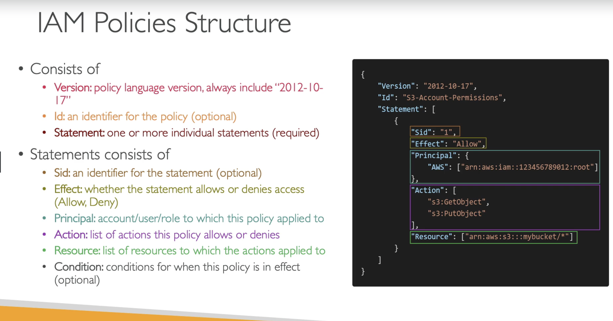
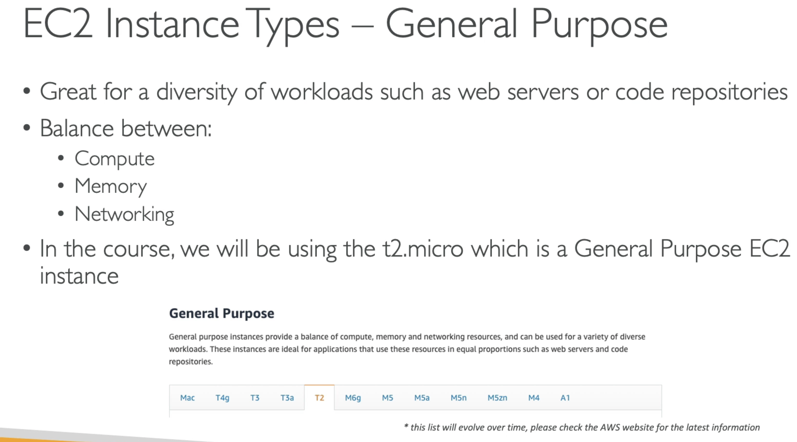
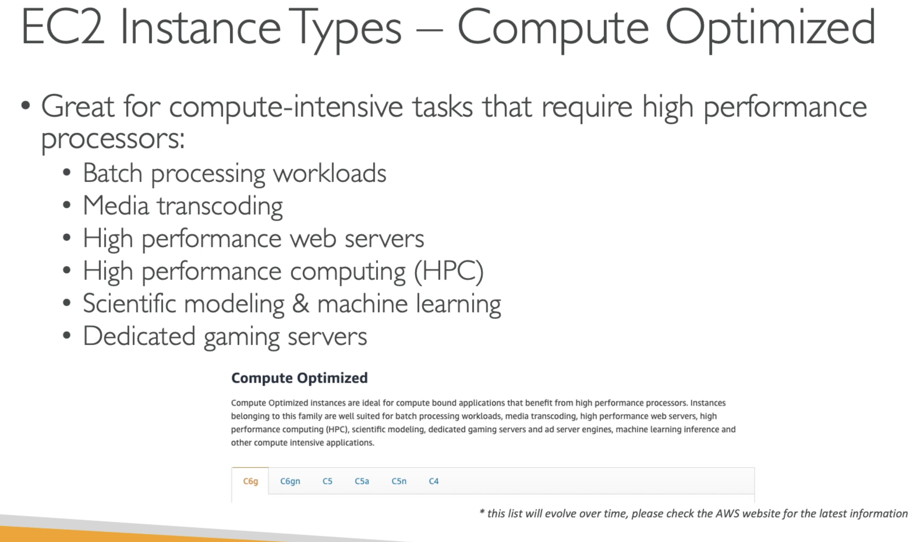
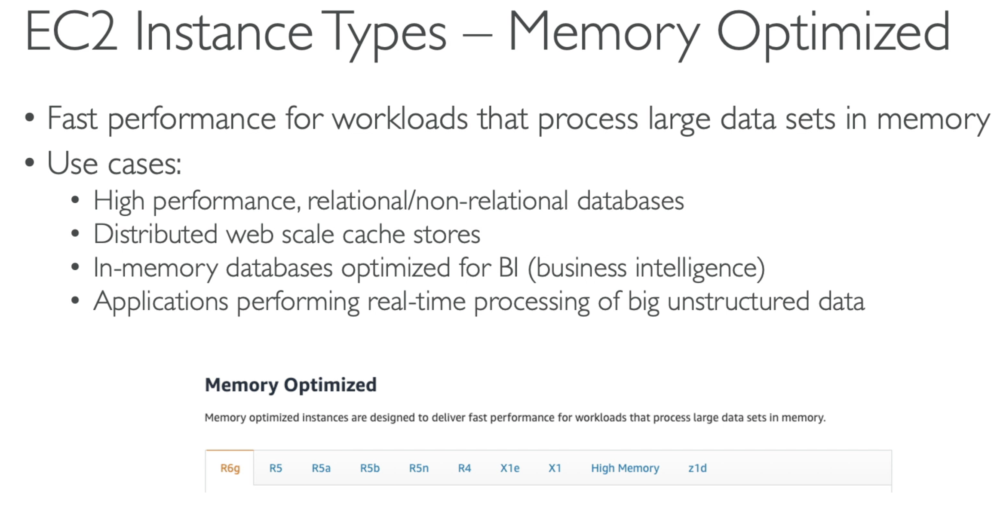
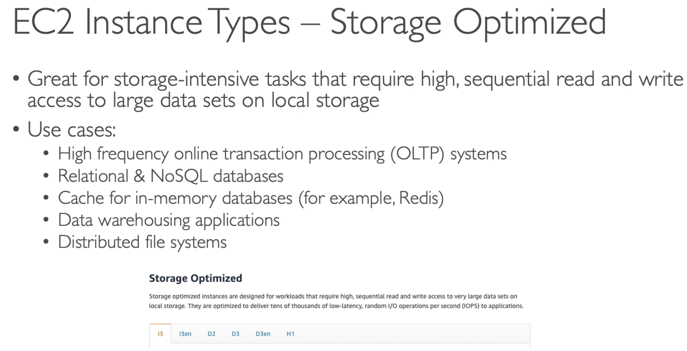
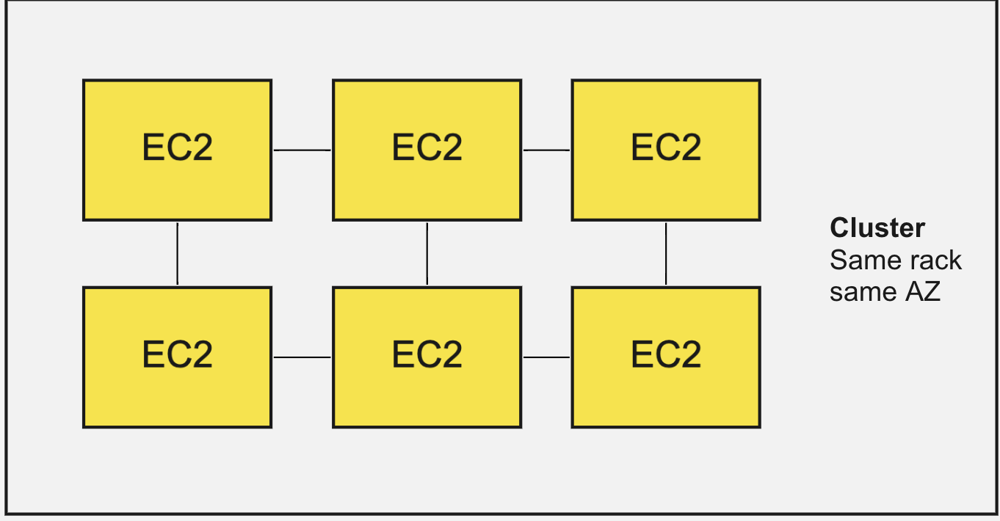
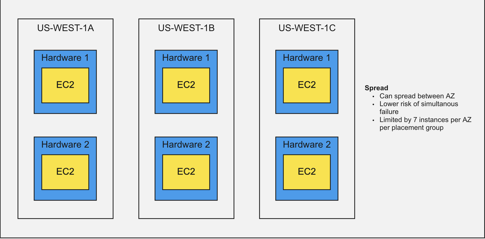
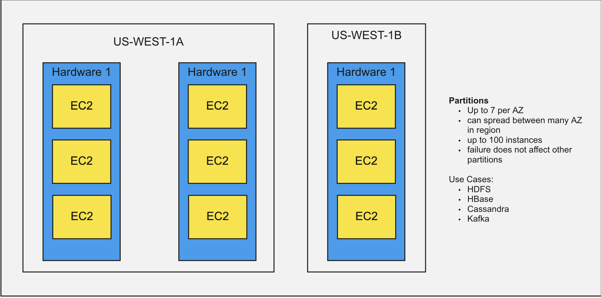

## AWS Solitions Architect Associate exam notes

**AWS Global infrastructure**
 - Regions  
 - Availability zones  
 - Data centers  
 - Edge locations  

Important notes:  
 - some services may exist only at some regions  
 - price between regions may differ  

### IAM

**IAM** - Identity access management, Global service  
Contains:  
 - Root user  
 - Groups  
 - Users  

Policies define permissions  

Policy:
```json

{
  Effect: Allow | Disallow
  Action:
  Resource:
}
```
 * Least privilege principle (don't give more than user needs)  
 * Permissions may be binded directly to the user or inherited from the group  
 * We can create our own policies via json configs or via visual editor  
 * For security purposes we can define passwords policies  
 * It is strongly recommended to use MFA (multi factor authentication)  
 * Accesskey should be generated by each user separately. Better not to share your AccessKeys  

CloudShell - allows you to run aws console in your browser (be careful: it is not available in all regions)  

IAM Role allows services to execute commands as some users  



**Types of policies**

*Identity-based policies with boundaries.*
You can create boundary policies to boundary policies (permit)
Identity policies grant permissions to resources (allow)
*Effective permissions* - intersection of boundary and identity policies

**Resource based policies control access for a specified resource**

*IAM role session* - grant access for the session (short period of time)
*IAM federated user sessions* -
*Organization SCP* - limits policies for the entire organization
*Session Policy* -

https://docs.aws.amazon.com/IAM/latest/UserGuide/access_policies_boundaries.html

IAM Access Analyzer policy validation.

**AWS Organizations**

Global Service
Allows to manage many AWS accounts
the main account is master account
Provides consolidated billing for all accounts - one payment method
    Plus: discount for EC2, S3, ....

OU - organization unit
SCP - service control policy
  - whitelist or blacklist IAM actions
  - applied to OU account level

Use cases:
 - restrict access to certain services
 - enforce PCI compliance be explicitly disabling services

**AWS RAM - Resource Access Manager**

Many accounts can share some resources
For example: VPC, private network

**AWS SSO**
May be used to provide access tokens instead of STS


### VPC

VPC - Virtual Private Cloud

CIDR - Classless Inter-Domain Routing - a method for allocating IP-addresses

CIDR consists of:
 - IP
 - subnet-mask
Example:  192.168.0.0/24

/8 => 255.0.0.0
/16 => 255.255.0.0
/24 => 255.255.255.0
/32 => 255.255.255.255 (only one IP allowed)

VPC consists of subnets
you can have multiple VPC in a region (max 5 - soft limit)

Max CIDR per VPC = 5
In VPC only private IPs allowed

Your VPC CIDR should not overlap between your networks

For each subnet AWS reserves next addresses:
10.0.0.0 - Network address
10.0.0.1 - VPC router
10.0.0.2 - for AWS DNS
10.0.0.3 - for future use
10.0.0.255 - broadcast address (but broadcast is forbidden)

**Internet Gateway**
Allows resources in a VPC connect to the internet
Scales horizontally, highly available and redundant

must be created separately from VPC

one VPC <=> one Internet Gateway

**Bastion Hosts** - it is your EC2 instances configured to pass requests to the private network

**NAT - Network address translation**
- must have elastic IP attached to it
- allows EC2 instances in private subnets connect to the internet
- must be launched in a public subnet
- route tables must route traffic from the private instance to the NAT instance
- must disable EC2 instance setting Source/destination check

You should use NAT Gateway instead of NAT instance

**NAT Gateway**
- AWS managed, high bandwidth, high availability, no administration
- pay per hour usage and bandwidth
- created in a specific AZ, uses an Elastic IP
- Can't be used by EC2 inst
- requires Internal Gateway:
- Private subnet => NAT Gateway => Internal Gateway
- 5 Gbs/sec bandwidth, scaled to 45 automatically
- Security Groups are not required
- Resilent in one AZ, you should create it in all AZ

**NACL - Network ACL**
 - Nacl is like a firewall which control traffic from and to subnets
 - One Nacl per subnet, new subnets get default nacl
 - newly created Nacls will deny everything

VPC Reachability Analyzer
0.1$ per analyze

**VPC Peering**
for connecting VPCs
To they behave like a one network
Not transitive (A <> B && A <> C != A<> C)

When we connect two VPC we must don't forget to create Routes

**VPC Endpoint** allows to connect from the private subnet to AWS resources
There are two types of VPC Endpoint:
 - Interface endpoint
 - Gateway endpoint (only for S3 and DynamoDB)

**VPC Flow Logs** allows to collect logs

**Customer Gateway** - for connection between customer network and VPC network (it works through VPN)

**Site-to-Site VPN connection**

**Direct connect (DX)** - dedicated connection from your on-premise DC to AWS. Very fast, goes not via internet

**AWS Private Link** - for exposing one application from VPC to the Peering connection

**Transit Gateway** - can connect multiple VPC to a one network
it's only one supports IP-multicast
ECMP - Equal cost multi-path

**VPC Traffic Mirroring**

**IPv6**
**Egress-only Internet Gateway** - like NAT Gateway, but for IPv6
Allows to get the internet from the EC2 instance in private VPC, but doesn't allow reach the EC2 instance from the internet.

- Internet Gateway
- NAT Gateway
- Egress Gateway

**Methods of connecting to a VPC:**
 ● AWS Managed VPN  
 ● AWS Direct Connect  
 ● AWS Direct Connect plus a VPN  
 ● AWS VPN CloudHub  
 ● Transit VPC  
 ● VPC Peering  
 ● AWS PrivateLink  
 ● VPC Endpoints  

**Costs for USA**
 - Incoming traffic is free  
 - communication between EC2 instances at the same AZ is free  
 - communication between EC2 instances in different AZ is paid:  
   - 0.02 per Gb using public IP  
   - 0.01 per Gb using private IP  
 - Communication betwee regions: 0.02 per Gb  

You must keep traffic in AWS to minimize costs  


**S3 data transferring**  

ingress traffic - free  
to internet - 0.09 per Gb  
S3 Transfer Acceleration  
    - from 0.04 to 0.08 per Gb  

S3 cross-region replication - 0.02 perGb  
From CloudFront to internet - 0.085 per Gb  

**High performance network**  

EC2 enhanced networking  
 - higher PPC, lower latency  
 - Elastic Network Adapter  
 - Intel 82599.... (Legacy)  

**Elastic Fabric Adapter**  
(only for Linux)  

### EC2

**EC2** - elastic compute cloud. Virtual machine  
**EC2 User data script** - for running once, when the machine is started  

Security Groups control in and out traffic of EC2. They have only allow rules.  

To working with aws from your EC2 it's better to assign roles to your EC2 instances. Using accessKeys may be not so good idea  

EC2 main types in pricing:  
* **EC2 on demand**  
  - short workload  
  - pay by second  
  - highest cost, no upfront payment  
* **EC2 Reserved Instances** - for long workloads  
  - reserved instances
  - convertable reserved instances
  - ~72% cheaper than on demand instances
  - you specify region, instance type, ...
  - there are payment options: upfront full, upfront part, ...
  - recommended for databases
  - may be bought or saled at the marketplace
  - may be converted
* **Saving plans**  
  - long workload
  - commit to a certain plan of usage
  - bounded only by price in plan
* **Spot Instances**  
  - short workloads
  - the cheapest
  - not reliable
  - Spot Fleets
* **Dedicated hosts**  
  - there are on-demand and reserved
  - entire server
  - the most expensive
* **Capacity reservations**  
  - no time commitment
  - no billing discounts






Elastic Ip allows to assign fixed IP-address for a EC2 instance.

Placement Groups -
  - Cluster - low-latency group in a single availability zone

  - Spread - spread instances across AZ - for critical apps

  - Partition - spread instances between regions


**ENI** - Elastic Network Interface
**AMI** - Amazon Machine Instance

**EC2 Instance Store** - contains own hard drive, has better IO performance. In case of terminaton loses it's storage. Good for: buffer, cache, ...

### File Systems

**EBS** - elastic block storage (via network)

EBS categories:
* **gp2/gp3**  
  - general purpose SSD (16k iops - max)  
  - IOPS and size are binded. When we increase size, IOPS are increased too!  

* **io1/io2**  
  - highest performance SSD (low latency, high IO)
  - 32k IOPS -max, 64k - for Nitro
  - can increase IOPS independently of storage size
  - io2 has more durability and more IOPS per GB
  - size: 4Gb - 64Tb
  - io2 BLOCK EXPRESS provides 256k PIOPS
  - supports EBS multiattach

 * **st1**  
   - HDD - low cost
   - can not be a boot volume
   - for big data, dwh, log processing
   - max IOPS - 500

* **sc1**  
  - HDD - the cheapest
  - max IOPS - 250

Criteries:  Size, Throughput, IOPS

**Instance Store**
 - storage binded to directly to a machine
 - highest performance
 - problem - in case of termination, data may be lost. You need to guarantee replication and backups

**EFS** - Elastic File System - managed NFS (network file system). Works for different AZ. More expensive then gp2

*Use cases*: content management, web serving, data sharing
Posix file-system
Pay per use (not by allocated Gbs)

Classes:
* **EFS Scale**
  - 1000 concurrent clients
  - 10+ Gb throughput
* **Performance Mode**
  - for latency sensetive
  - Max IO
* **Throughput Mode**
  - 50-100 Mb/s

+There is Multi-AZ

### ELB - Elastic Load Balancer

There are 4 types of balancers:
* **CLB** 
  - classic load balancer (deprecated)
  - L4, L7
  - HTTP, HTTPS, TCP, SSL

* **ALB**
  - application load balancer
  - L7
  - HTTP, HTTPS, WebSocket
  - latency: ~400ms

* **NLB**
  - network load balancer
  - TCP, TLS, UDP
  - latency: ~100ms

* **GLB**
  - gateway load balancer
  - IP

ELB allows to create sticky sessions with cookies. Application or ELB may generate a cookie to bind user requests to the exact application instance.

With ELB we can use cross-zone load balancing: when a ELB in one zone can send requests to application in another AZ.

**SNI** - Server Name Indication. Works for: ALB, NLB, CloudFront
**ACM** - Amazon Certificate Manager

*Connection draining* - for graceful reload

**ASG** - Auto Scaling Groups. ASG is free, you don't need to pay for it, you pay only for EC2 instances. Launch Template describes the configuration for ASG.

### Databases, caches

**RDS** - Relational Database Service

RDS allows use to use:
  - Postgres
  - Mysql
  - MariaDB
  - Oracle
  - Microsoft SQL
  - Aurora

AWS provides:
 - automated patching OS
 - continuous backups and restore to a specific timestamp
 - monitoring
 - replication
 - maintenance windows
 - scalability
 - NO SSH ACCESS

* Daily backups => 7 days retention (may be increased)

There are backups and snapshots
 - backups are created automatically
 - snapshots are created manually

Storage may be increased dynamically (automatically)
You can set maximum scale size

Replication between AZ is free
But! Replication to another region is paid

With sync replication your app may be automatically connected to the replica and replica may become a master for disaster recovery situation

RDS data may be encrypted at launch
If master is not encrypted, then replicas can not be encrypted

Also there is in flight encryption with SSL

Unencrypted database may be encrypted by making and restoring a snapshot

IAM athentication allows you to use a token for authentication in database. This token lives 15 minutes

**Elasticache** - for Redis or Memcache
Doesn't support IAM authentication
* **Redis**
  - multi AZ with FailOver
  - read replicas
  - data durability via AOF persistence
  - backup and restore feature

* **Memcache**
  - Sharding
  - no replication
  - not persistent
  - no backup and restore
  - multi-threaded architecture

**Aurora**
API compatibe to Postgres

Data is held in 6 replicas in 6 AZ
Out of the box: Multi AZ, Auto Scaling Read Replicas

Can be global for disaster recovery

 - Aurora is a proprietary DB
 - Aurora is cloud-optimized, it 5x faster than mysql or mariadb and 3x faster than Postgres
 - Aurora may have 15 replicas and replication is faster (less 10 ms)
 - Failover is very fast (less 30 sec)
 - Aurora is more expensive (+20%)
 - Aurora is high availability and read scaling (6 copies across 3 AZ, requires 4 copies of 6 to write and 3 copies out of 6 to read)
has self healing via peer-to-peer replication

scales from 10Gb to 126Tb

Multi-AZ uses synchronous replication
+ Serverless
+ Multi-master

**Amazon DynamoDB**

Fully managed, highle available, multiAZ
NoSQL

Million requests per second

fast and consistent performance
law latency on retrieval

Enables event-driven programming with dynamodb-streams

There are two classes:
 - standard
 - infrequent access

Max Item size = 400Kb

Price control:
 - provisioned
     you set read and write capacity and pay for this capacity
     (you need to plan capacity)
      also you can add auto-scaling
 - on-demand mode
    auto-scaling
    pay as you use
    more expensive (2-3 times)
    useful for very unpredictable usages

you don't create database, you create table.
during the creation table, you install partition_key and sorting_key
also you can add secondary indexes

Data Streams
 - sent to Kinesis Data Stream
 - Read by lambda
 - data retention - 24h

Global Table - cross-region table
 - for low-latency cross-region
 - active-active replication
 - requires enabling Data Streams

TTL - for auto-delete

Global Secondary indexes, Local Secondary Indexes

There is Transactions maintenance

Reads can be eventually or strong consistent

**DynamoDB Accelerator (Dax)**
 - fully managed, highly available, seamless in-memory cache for DynamoDB
 - provides microseconds latency for cached data
 - doesn't require any application changes


### Route53 - DNS
Route 53 - for managing DNS records
Also it's domain register

You can create public and private domain names

The price for DNS record - 0.50$

**CNAME** - works only for not root domain
**Alias** - works for root domains too on aws resources
   - it's free (no payment)

*Route 53 supports Routing policies:*
* **simple**
  - route traffic to a single resource
  - may be a list of A records in an answer
  - can't be associated with health-checks

* **weighted**
  - you can distribute traffic between instances with weights
  - DNS records must have the same name and type
  - for: load-balancing, test-checks

* **failover**
  - you can define main and secondary target instances
  - secondary becomes when the main fails down

* **latency based**
 - redirects to the closest app by latency
 - latency bases on the traffic between AWS and users region

* **geolocation**
  - for routing requests to different instances based on users region

* **geoproximity**
  - like geolocation, but allows you to direct traffic based on some value called bias

* **Multi-Value**
  - for client-side load-balancing

Route 53 can execute health-checks

Route 53 Hosted zone is required to manage your DNS records

### S3
Buckets must have global unique names
Buckets are defined at region level
Max file size is 5Tb

Bucket may have private and public access

It is a good approach to use files verions

There are 4 methods to encrypt objects in S3:
 - **SSE-S3** - encrypts using keys handled and managed by AWS
 - **SSE-KMS** - encrypts using keys handled and managed by KMS
 - **SSE-C** - by  your own keys
 - **Client-side encryption**

S3 provides SSL encryption

**Security:**
 - IAM Policy - which API calls allowed for which user
 - Object ACL
 - Bucket ACL

IAM policy - for user can do
Resource policy - what operations are allowed on this bucket

There are accessLogs which can be stored to another S3 bucket

S3 guarantees strong consistency

IAM policy simulator - tool to check policies at Amazon

http://169.254.169.254/ - is a special url with which you can access a lot of information about your EC2 instance

You can enable default encryption to encrypt files uploaded to s3

It's possible to log into access log info about each request to the S3 bucket

Replication - you can replicate content of your bucket into anther (in the same region or another). It requires versioning and replication.
This replication is async and it replicates only new changes.
Also you can replicate existing objects with S3 Batch Replication.
Replication may be applied in complience purposes.
By default delete actions are not replicated

S3 Storage classes:
 - **stantard**
    - 99.99 availability
    - used for frequently accessed data
    - low latency, high throughput
 - **IA** - infrequent access
    - 99.9 availability
    - lower cost than standard, but requires to pay for retrieval
    - use-cases: disaster-recovery, backups
 - **One zone IA**
    - 99.5 availability
    - data is stored in one DC
 - **Intelligent tiering**
    - automatically moves object between storages
 - **Glacier instance retrieval**
    - price for storage+price for retrieve
 - **Glacier flexible retrieval**
 - **Glacier deep archive**

AWS automatically scales to hight performance with latency 100-200ms.
Your application can achieve 3500 rps for writing and 5500 rps for reading per prefix in a bucket. Prefix - part of url (folders). Therefore it may be better to create folders in bucket.

If encryption is turn on for your bucket, you may be affected by KMS performance.

S3 Select & Glacier select allow to perform filtering by rows and columns in your files. It can improve the performance of you application and decrease costs, because less data is transferred by network

AWS allows to customize payment. You can pay just for storing data, but for downloading file requester will pay

**Glacier Vault Lock** - allows to lock an object and forbid its changes with vault lock policy. May be used for compliance.


### Athena

Athena-service allows to perform analytics against S3 objects

It can execute SQL queries.

supports: json. csv, Avro, parquet, ORC

Pricing: 5$ per Tb data scanned
Tip:  use compressed or columned data for saving costs

Use cases: BI, analytics, reporting, logs investigation

Exam tip:  analyze data in S3 using serverless SQL

### CludFront

CloudFront - Content-delivery-network

Origin Access Identity - for IAM role for cloudFront

CloudFront Signed Url / Signed Cookie - for controlling read access of objects
  - signed URL gives access to an individual file
  - signed cookie - gives access to many files

Also there is pre-signed URL for access directly to S3 bucket

There are 3 classes of CloudFront edge locations:
- 1 - all
- 2 - all except the most expensive
- 3 - 100 the cheapest

Cloud Front Geo Restriction allows to provide access only for users from some exact region

**AWS Global Accelerator** provides  Unicast and Anycast IP.
Anycast ip directs requests to the nearest edge location

Appropriate for dynamic content

### Snow family

**AWS Snow Family** - highly secure portable devices to collect and process data at the edge and migrate data into and out of AWS

data migration:
 - **Snowcone** - small device with 8Tb
 - **Snowball edge** - big device with tens Tb space
 - **Snowmoblie** - lorry for exabite data - for more than 10Pb data

Data computing:
 - **Snowcone** - 2CPU, 4Gb memory
 - **Snowball edge compute optimized** - 52 CPU, 208 Gb RAM, 42 Tb storage
- **Snowball edge storage optimized** - 40CPU, 80 Gb RAM,

> can run AWS EC2 instances or lambda functions (using AWS IOT Green Grass)
> for data processing, ML, ...

You can not import data from AWS Snowball directly to your Glacier storage. You need to import it firstly to S3 and then via lifescycle policies it can be moved to the Glacier storage

### FSx

**AWS FSx** - fully managed third party file-system

**FSx for Windows** - shared file system for WIndows like EFS for Linux.
Supports SMB and NTFS, Active Directory and ACL
Also can be mounted to Linux EC2 instances
Can be configured to Multi-AZ
Data is backuped daily to S3

**FSx Lustre** - parallel high performance, for large scale computing
Seamless integration with S3
  - can read S3 as file system through FSx
  -  can write result of computation back to S3
  - can be used from on-premise

Options:
- scratch file system
    - Data is not replicated and may be lost
- persistent file-system
    - long-term storage. Data is replicated in the same AZ

**AWS Storage Gateway** - bridge between on-premise data and cloud data in S3

use cases: backup

3 types of storage gateway:
 - File Gateway (for EFS, FSx)
 - Volume Gateway (for EBS)
 - Tape Gateway (for S3)

Can be integrated with Active Directory

Hardware Appliance - you can install a special server inside your DC which will provide Storage Gateway logic

**Amazon FSx File Gateway** - native access to Amazon FSx for Windows File Server

provides cache for low-latency

SMB, Active-Directory, NTFS

**AWS Transfer Family** - fully managed service for file transfers into and out of Amazon S3 or EFS using the FTP protocol

You can provide public FTP-like interface, but keep data in S3 (or EFS)

supported protocols:
 - AWS Transfer for FTP
 - AWS Transfer for FTPS
 - AWS Transfer for SFTP

### SQS

**SQS**  - Simple queue service

- unlimited throughput, unlimited number of messages in queue
- default retention for message - 4 days, maximum - 14 days
- low latency (<10 ms on publish and receive)
- limit: 256Kb per message
- message can be delivered twice
- at least one delivery

Security:
 - HTTPS for inflight API
 - At-rest encryption using KMS
 - client-side encryption

Access-control
 - IAM
 - SQS Access-policy

There is message visibility timeout during which message is not shown again. Default value = 30sec. But consumer may call changeMessageVisibility to avoid message duplication

SQS provides DLQ. You can move many messages as batch from DLQ to the source queue.

SQS supports Delay queues

SQL client works with Poll-approach

SQS supports Request-Response approach. To implement this pattern you can use SQS Temporary Queue Client. It leverages virtual queues instead of creating real SQS queues.

SQS Fifo guarantees the order of messages
limits: 300 messages/sec or 3000 messages/sec for batching
there is exactly-once capability

### SNS

SNS - Simple Notification service (publish-subscriber pattern)
(From one to many)

Data is not persisted (deleted if not delivered)

SNS + SQS + Fan out

SNS FIltering - json rule for filtering messages

### Kinesis

Kinesis - makes easy to collect, process and analyze streaming data in real-time (logs, metrics, IOTs)

Kinesis data-streams - for capture, process and store data
  retention: between 1 to 365 days

Kinesis data-firehose - load data streams into AWS data stores
   - fully managed
   - stores data into S3, elastic, ...
   - pay for data going through
   - supports conversions, transformations, compression
   - can send failed data to S3

KInesis data-analytics - for analyze data streams with SQL or Apache Flink
use cases:
  - time-series analytics
  - real-time dashboards
  - real-time metrics
KInesis video-streams - capture, process and store video-streams

### Amazon MQ

Amazon MQ - Managed Apache ActiveMQ

runs on a dedicated machine, not autoscaled
has queue and topics

Can be run in two AZ, requires EFS for storing data

### Containers

**ECR**  - Elastic Container Registry

**ECS Task** - for running containers

**ECS** - Elastic Container Service
**ECS2 Launch type** - you allocate machines EC2 instances and run containers there
**AWS Fargate**
  - for running containers
  - you don't allocate containers, it's serverless

**EKS** - Elastic Kubernetes Service

You can mount EFS into your ECS Tasks
Fargate + EFS = Serverless (pay as you go)
FSx for Lustre is not supported

ECS Auto Scaling
  - per CPU utilization
  - on RAM
  - number of requests per Task
options:
  - Target tracking - based on metric
  - Step scaling - based on specific CloudWatch Alarm
  - Scheduled Scaling - based on a specific date/time

There are two options to scale EC2 Launch Type instances:
 - Auto Scaling Group
 - ECS Cluster Capacity Provider

### Lambda functions

Limits
 - memory: 128MB - 10GB
 - Max exec time - 15min
 - env variables - 4Kb
 - Disk capacity - 512Mb
 - Concurrent execution - 1000 (may be increased)
 - deployment size (compressed) < 50Mb
 - deployment size (uncompressed) < 250Mb


Lambda@edge - for running functions in nearest regions (global)

**API Gateway**

 - supports websocket
 - API versioning
 - multiple envs (dev, test, prod)
 - Auth-n, authr-n
 - Api keys, throttling
 - Swagger, OpenApi to define API
 - transform and validate requests
 - cache api responses

Api gateway endpoint types:
 - Edge-optimized (default)
     - requests routed via CloudFront
     - API gateway is in the region
 - Regional
 - Private

**Security**

IAM policy
Lambda Authorizer
  - option to cache the result
  - helps to use Oauth/SAML
  - lambda must return IAM policy for the user

Cognito
 - fully manages user lifycycle
 - API gateway automatically verifies from AWS Cognito
 - cognito only helps with authentication, not authorization
 - can be backed by Facebook, Google, ...

Cognito User Pools
   - sign in
   - integrate with API Gateway
   - Federated Identities (facebook, Google, ...)

Cognito Identity Pools
  - for IAM users

Cognito Sync => AppSync

### CloudWatch

Cloud Watch (like grafana)

Metric - some value
Dimension (max 1- per metric)

EC2 Instance RAM is not sent automatically, it should be sent inside from instance

Cloud Watch Dashboard
 - global
 - can include graphs from different AWS accounts and regions

Dashboard may shared with people who don't have AWS account

Types of monitoring:
 - standard - 5, 10 min
 - detailed - 1 minute
 - high resolution - 1, 10, 30 sec


### CloudTrail

CloudTrail

Provides governance, compliance and audit for your AWS account

you can get history of commands, API calls, CLI, ...
Can put logs from CloudTrail into CloudWatch Logs

Example: if some EC2 instance was deleted, you can investigate it with CloudTrail

types of events:
 - management (configurations, creating something, modification resources). Can collect read events and write events
 - data events (by default are not written). Can collect read events and write events. Also here may be logged lambda functions invokes
 - insights - can analyze events and try to find unusual activity. (inaccurate resource provision, ...)

By default events are stored during 90 days.

To store them more, you can send them to S3 and analyze with Athena

### Config

Config

Allows to create limits for resources:
  - type of EC2 machine

IT DOESN'T PREVENT!!!!
it just allows to check!!

allows to deactivate IAM user and allocated resources or create notificatons

(for compliance control allocated resources)

For example: you can detect EC2 machines with open 22 ports for the world

### Cloud Watch Logs
- groups
- stream
- expiration
- export (S3, elasticSearch, ...)

Cloud Watch Alarm
 - for some actions (scale, notifications, termitate, ...)
If you set an alarm on a high-resolution metric, you can specify a high-resolution alarm with a period of 10 seconds or 30 seconds, or you can set a regular alarm with a period of any multiple of 60 seconds.

command:
"aws cloudwatch alarm ...."

CloudWatch Events
  events from other services (S3, ...)
  send notifications on some actions (EC2 instance created, stopped, ...)

CloudWatch EventBridge
  aggregate events from many accounts, regions, ...

### STS - Security Token Service

allows to provide limited Access to AWS resources
token is valid up to one hour (must be refreshed)

assumeRole
assumeRoleWithSaml
assumeRoleWithWebIdentity

GetSessionToken - for FMA

use cases:
 - create IAM Role with some access
 - define principles for this IAM Role
 - use AWS STS to retrieve credentials (accessToken) and impersonate access
 -

Cross account access, assume some role

### Identity Federation

Federation allows to users outside AWS to assume temporary Roles for accessing Resources

Allows to use:
 - SAML 2.0
 - cutom Identity Broker
 - Web Identity with Cognito
 - SSO
 - Microsoft AD

(User Management is outside AWS)

Better to use Cognito instead of Web Identity Federation

### AWS AD
allows to create your own managed AD service
you can syncronize your own AD with AWS AD
AD Connector - proxy to on-premise

### Security

**KMS** has a limit for encrypted data: 4Kb
If size of the data is more, the you can use envelope encryption

KMS is linked to a region. And you can not get key from another region.
If you want to move encrypted data from a one region to another, you need to reencrypt data by a key from another region (for example, for EBS volume)

Key policies are similar to resource policies

for AWS managed keys only services who uses these keys can access them
Customer managed keys: 1$ per month

Key rotation happens once a year
Previous key is active, so you still can decrypt the old data

**SSM Parameter Store**
Secret store for configuration and secrets
Serverless, scalable, durable, versioned

**Secrets Manager**
 - newer service (instead of SSM)
capable to rotate secrets every X days
has integrations with RDS, Dynamo, ..

**CloudHSM**
For hardware encryption
You control it entirely
multi AZ
AWS can not access it

**Shield**
For protection against DDOS
Free service, activated automatically

**Shield Advanced**
3000$ per month
protects against more sophisticated attacks

**WAF**
firewall for web-atacks
For L7

deployed on ALB, Api Gateway or CloudFront
protects against SQL injections, XSS, ...
adds constraints on the size of requests
geomatch constraints
+DDOS protection

**Guard Duty**
Intelligent threat detection
explores:
  - CloudTrail logs
  - VPC logs
  - DNS logs
  - K8s audit logs

**Macie**
fully managed data security and data privacy service
uses ML
alert about personal data
can discover S3, find personal data and alert about it

**Inspector**
Automated security assessments
Can analyze versions of OS in EC2
Only for EC2 and containers!!!

### Disaster recovery
**RPO** - recovery point objective
**RTO** - recovery time objective

**Disaster recovery strategies:**
 - backup and restore
 - Pilot light
 - warm standby
 - Hot site / Multi site approach

**DMS** - database migration service

for migrating data to AWS
supports homogenous migration (Oracle => Oracle) and geterogenous (MS SQL => Aurora)

also supports CDC
**AWS SCT** - schema conversion tool

**Data Sync** - for moving large amount of data into AWS from on-premise
you can sunchronize to:  S3, EFS. FSx,
replication tasks may be scheduled (hourly, weekly, ...) - it is not continuous

You need to install DataSync Agent on your system and run DataSync in cloud

**AWS Backup**
Fully managed service

Supports:
 -S3
 - EC2/EBS
 - RDS
 - DynamoDB
 - FXs
 - EFS
 - ...

Cross-region
Cross-account

There are backup plan, backup-window

AWS Backup Vault Lock - only read and don't delete
