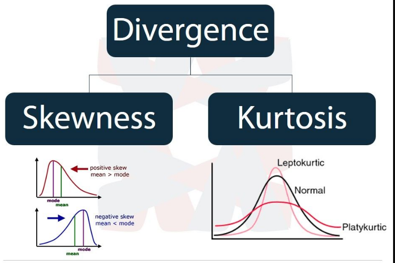
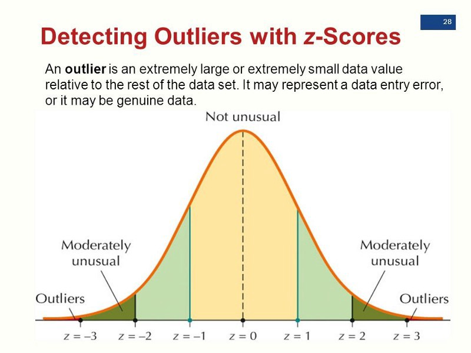

## Основные термины и определения

Наблюдение может быть сплошным и выборочным. Сплошное - исследованию подвергается вся генеральная совокупность (все возможные и существующие случаи). Выборочное - из генеральной совокупности делается некоторая выборка, которая должна быть репрезентативной и на ее основе делается анализ и предсказание относительно всей генеральной совокупности.

В большинстве случаев нам приходится работать с выборочным наблюдением, поэтому мы должны понимать порядок ошибки, на величину которой наши предсказания могут отличаться параметры выборочного наблюдения от параметров сплошного наблюдения.

Выборочный показатель, который при многократном повторении выборки стремится к своему теоретическому значению, называется несмещенной оценкой.
Почему оценкой? Потому что мы не знаем реальное значение показателя (по генеральной совокупности), и с помощью выборочного наблюдения пытаемся его оценить. Оценка показателя – это есть его характеристика, рассчитанная по выборке. [1]

**Среднее арифметическое** - среднее значение по выборке  

**Математическое ожидание** - среднее значение случайной величины при стремлении количества выборок или количества её измерений (количества испытаний) к бесконечности  

**Выборочная средняя** – это несмещенная оценка математического ожидания, так как средняя из выборочных средних стремится к своему теоретическому значению по генеральной совокупности  

**Дисперсия** - мера разброса случайной величины относительно ее математического ожидания или, по-другому, это математическое ожидание отклонений от математического ожидания  

Несмещенность оценки – одна из важных характеристик статистического показателя. Смещенная оценка показателя заранее говорит о тенденции к ошибке. Поэтому показатели стараются оценивать таким образом, чтобы их оценки были несмещенными (как у средней арифметической). Чтобы решить проблему смещенности выборочной дисперсии, в ее расчет вносят корректировку – умножают на n/(n-1), либо сразу при расчете в знаменатель ставят не n, а n-1. [1]

Выборочная смещенная дисперсия:  


Выборочная несмещенная дисперсия:  


При большом объеме выборки (от 100 наблюдений) разница между смещенной и несмещенной дисперсиями практически исчезает.

**Стандартное откл-е/среднеквадратическое откл-е(std)** - показатель рассеивания значений случайной величины относительно её математического ожидания (равняется корню из дисперии)   
  

**Медиана** - значение, которое делит выборку таким образом, что ровно половина ее будет больше, а другая меньше. Медиана не обязательно совпадает со средним значением. Отклонение медианы от среднего называется перекосом данных  


**skewness** - характеристика того, насколько сильно мода отличается от среднего  
skewness может быть положительным и отрицательным в зависимости от смещения распределения  

**Стандартная ошибка выборочного среднего** -  величина, характеризующая стандартное отклонение выборочного среднего, рассчитанное по выборке размера n из генеральной совокупности  
*центральная предельная теорема*: при извлечении некоторой выборки из генеральной совокупности выборочное среднее окажется в той же точке с ошибкой равной:  
  

**Уровень значимости** - обозначает вероятность получения случайного отклонения от установленных с определенной вероятностью результатов. Этот параметр задается вручную и обычно принимает значения: 0.05, 0.01, 0.001.  

**Доверительный интервал** - интервал, в который с заданным уровнем значимости попадает случайная величина  

**Доверительный уровень** - вероятность того, что значение случайной величины попадет в доверительный интервал. Равняется: 1-уровень_значимости    

**Предел погрешности** - статистическая величина, определяющая, с определенной степенью вероятности, максимальное значение, на которое результаты выборки отличаются от результатов генеральной совокупности. Составляет половину длины доверительного интервала.  

**Ковариация** - мера линейной зависимости двух случайных величин (показывает насколько два числа линейно связаны)  
![cov(X,Y) = M[(X - MX)(Y - MY)]](http://bit.ly/2LS1xrh)

**Z-нормма (стандартизованная оценка)** -  это мера относительного разброса наблюдаемого или измеренного значения, которая показывает, сколько стандартных отклонений составляет его разброс относительного среднего значения. Это безразмерный статистический показатель используемый для сравнения значений разной размерности или шкалой измерений  
Z = (xs - m) / se  
xs - выборочное среднее  
m - среднее генеральной совокупности  

Виды формирования выборок из генеральной совокупности: 
 - simple random sample  
 - stratified sample  
 - cluster sample  

Стандартная ошибка выборочного среднего(центральная предельная теорема):  
*При извлечении некоторой выборки из генеральной совокупности выборочное среднее окажется в той же точке с ошибкой равной:*    
Se = sigma/sqrt(n)

**Z-нормировка:**
Z = (xs - m) / se  
xs - выборочное среднее  
m - среднее генеральной совокупности  

Для оценки среднего генеральной совокупности  
95% точность: Xs = m +/- 1.96 se  
99% точность: Xs = m +/- 2.58 se 
m - среднее по выборке  
se - стандартная ошибка  

Если число наблюдений невелико и sigma неизвестно, то используется *распределение стьюдента*  
Форма распределения определяется числом степеней свободы  
Число степеней свободы - количество элементов, которые могут варьироваться при расчете статистического показателя  
df = n - 1  
t=(x_ - m) / (sd / sqrt(n))  

Sst - sum squares total  
Sum(a[i] - m)^2  
Ssw- внутригрупповая изменчивость  
Sum(a[i] - m)^2  
- Вычисляется для подгруппы  

**Ssb** - межгрупповая изменчивость  
Количество степеней свободы = n - поправка Бенферони - позволяет скорректировать уровень значимости для большого количества выборок  

Критерий Тьюки - альтернатива методу стьюдента  

Дисперсионный анализ - TODO

Коррекционный анализ Пирсона стоит использовать при нормальном распределении и линейности данных  

Коэффициент корреляции Спирмена - менее чувствителен к ненормальности и нелинейность данных  

Регрессионный анализ:  
 - метод наименьших квадратов   

*Коэф детерминации* - доля дисперсии зависимой переменной объясняемая регрессионной моделью  

Если две переменные количественные, то стоит использовать корреляционный анализ или линейную регрессию. Если же одна из переменных номинативная, то стоит использовать t-тест или дисперсионный анализ.  


**Регуляризация** - борьба с переобучением модели

**Оптимизация гиперпараметров** - механизм поиска оптимальных параметров модели с учетом минимизации функции потрерь  

**Распределение Бернулли** — дискретное распределение вероятностей, моделирующее случайный эксперимент произвольной природы, при заранее известной вероятности успеха или неудачи.  

**Least squares method (метод наименьших квадратов)** - метод подбора коэффициентов модели основанный на
минимизации суммы квадратов отклонений некоторых функций от искомых переменных  
```python
SUM( y[i] - f(x[i]) )^2 => min
```

[Хорошая статья по loss-функциям](https://heartbeat.fritz.ai/5-regression-loss-functions-all-machine-learners-should-know-4fb140e9d4b0)  


## Нормировка данных
Зачастую бывает необходимо выравнять данные относительно центра координат.
Для этого можно использовать:
 - StandardScaler - нормализует набор данных таким образом, чтобы каждый столбец X имел mean=0 и std=1  
 - MinMaxScaler  

## Подбор гиперпараметров

**Grid Search** - метод грубого подбора гиперпараметров модели путем перебора значений по сетке с заданным шагом  
**Random Search** - метод перебора гиперпараметров с целью поиска максимума оптимизируемой функции (не требует, чтобы функция была непрерывной)  
**Bayesian optimization**
**Gradient-based optimization**
**Evolutionary optimization** - эволюционные отбор)


### Метрики

**Cartesian product** - Евклидово произведение  
**косинусное расстояние** - довольно большая формула, часто используется для определения расстояния между текстами. Каждый документ описывается вектором, каждая компонента которого соответствует слову из словаря. Компонента равна единице, если соответствующее слово встречается в тексте, и нулю в противном случае. Тогда косинус между двумя векторами будет тем больше, чем больше слов встречаются в этих двух документах одновременно.
[Вот основные метрики](https://delirium-00.livejournal.com/7215.html)  

**[Нормированная z-оценка (Z-score)](#z-norm)**
```python
X` = (X - mean) / sigma
```
 - чрезвачайно важный показатель. Позволяет избавиться от выбросов данных  
Пример использования:
```python
newtrain = train[(np.abs(stats.zscore(train.select_dtypes(include=np.number))) < 3).all(axis=1)]
```
Математический смысл данной операции:  



### Комбинирование моделей

#### Ансамбль
Набор моделей голосуют, результат определяется заданным образом (через кворум или же наибольшее значение или ...)  
При этом, стоит заметить, что модели обучаются независимо  

#### Бэггинг
Пример - RandomForest  
Является подвидом ансамблей  

#### Бустинг
Является подвидом ансамблей  
Суть в том, что мы и обучаем модели совместно, и используем в дальнейшем  


## notes
### Работа с категориальными признаками
Приведение категориальных текстовых признаков к числовым надо делать с осторожностью. Не стоит приводить данные к числам и оставлять все в одном столбце, т.к мы таким образом создадим возможность вычитать и складывать эти значения и определим функцию расстояния между ними. Вместо этого при приведении категориальные признаков к числовым необходимо распределять признаки по различным столбцам.


Ссылки, источники:
 - [1. Выборочная несмещенная дисперсия - отличнейшая статья](https://statanaliz.info/statistica/opisanie-dannyx/vyborochnaya-dispersiya/)  
