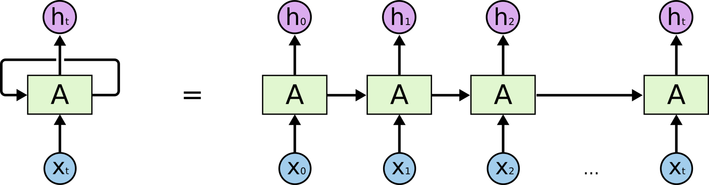

# Neural networks

## Функции ???

### Softmax
Функция, которая позволяет свести сумму значений выходов слоя к 1.
За счет того, что в основе используется экспонента, значения, которые незначительно
больше остальных при возведении в экспоненту начинают доминировать значительно сильнее  
Обычно ставится на выходе нейросети  
```python
sigma = e[i] / sum(e[j])
```
Часто применяется в задачах классификации в последнем слое при количестве классов большим 2-х и
трактуется как вероятность принадлежности к классу  
При обучении в качестве функции потерь используется cross-entropy  


### Relu
Очень примитивная, но чрезвычайно эффективная функция активации  
Обычно используется между слоями  
То, что функция не имеет производной в точке 0 не влияет на обучаемость  
```python
f(x) = x < 0 ? 0 : x
```
Посольку relu слева от нуля плоский и довольно редко, но возможна ситуация, когда
обучение застревает на том, что не получается выбраться из плато слева, то
используются альтенративы relu: leaky relu и exponential relu - ELU

### tanh
Красивая дифференцируемая  
Проблема этой функции в том, что она довольно слабо начинает изменяться для значений
сильно правее и левее 0. Скажем, после того как мы достигли 4 по X, любые небольшие смещения 
вправо и влево практически не меняют Y. Из-за этого все предыдущие слои перестают обучаться
и стопорится обучение всей модели.


Каким значением инициализировать значения W?
>  a = 1 / SQRT(input_numbe r)


### SGD

### Momentum
velocity = momentum * velocity - learning_rate * gradient
по направлению градиента увеличиваем не просто веса, а скорость изменения весов
+ есть момент затухания

### NAG

### Adagrad
Идея в том, что learning_rate не является константой для всех измерений.
Там, где по направлению градиента значение функции изменяется сильно, там будет шагать слабее
и наоборот: там где значение функции меняется не сильно, будет шагать большими шагами,
чтобы постараться перешагнуть локальные минимумы

### RMSProp
accumulated = rho * accumulated + (1 - rho) * gradient ^ 2
adaptive_learning_rate = learning_rate / sqrt(accumulated)

### Adam
???

## Типы архитектур

### Персептрон
Не буду описывать, т.к. это элементарная архитектура и описана повсюду миллион раз

### LSTM (Long-short term memory)
разновидность рекурентной архитектуры сетей  
Хорошо приспособлена к обучению на задачах классификации, обработки и
прогнозирования временных рядов, распознавании речи.  
Невосприимчива к длительности временных рядов.  
[Отличная статья про LSTM](https://habr.com/ru/company/wunderfund/blog/331310/)  



### Permutation Importance
 - Техника позволяющая оценить важность атрибутов во входных данных

### Dense-layer
Fully-connected-слой (полносвязный)  

## Deep learning

Нужно наблюдать за loss и на train, и на validation

большая ошибка на train - overfitting
 - более мощную модель  
 - больше ресурсов для тренировки  
 - другой подход  

методы борьбы с переобучением (регуляризация):
 - dropout - в процессе обучения модели часть нейронов исключается 

большая ошибка на validation - underfitting
 - больше данных  
 - больше регуляризации  
 - другой подход  

learning rate - скорость обучения (график зависимости функции потерь от эпохи)  

Методы улучшения learning rate:
 - annealing (каждые x эпох умножать loss на l)

**batch normalization** - техника, применяемая и при overfitting, и при underfitting  
 - приводит std к определенному значению  
 - ускоряет и стабилизирует тренировку  
В ней используются средние значения в batch-ах, при работе в режиме предсказания
используются средние накопленные в процессе обучения  

Итого:
 - вычитаем среднее из данных  
 - оптимизатор - Adam  
 - batch-normalization - must have  
 - learning rate annealing - на плато  
 - смотрим на графики  


### CNN
Операции свертки:
 - edge detection  
 - sharpen  
 - box blur  

Важные характеристики ядра свертки:
 - padding - дополнение входного вектора доп значениями по краям  
 - stride - размер шага ядра свертки  

**FC** - fully connected layer  

#### ResNet (residial nets)
Работает за счет того, что на следующий слой передается не только выход от предыдущего,
но и его исходный сигнал. Таким образом, следующий слой получает на вход не F(x), а F(x) + x.
Оказалос, что такое изменение позволило тренировать значительно более глубокие сети.  

#### Inception
#### AlexNet


#### Transfer learning
Применяется когда мало данных. Идея в том, чтобы взять глубокую сеть уже натренированную
и заморозить все слои в начале и середине, а тренировать только последние выхоные слои,
которе FC и SoftMax. С входными данными обычно поступают так: scale-ят, но это по ситуации.
Также можно тренировать слои с максимальной интенсивностью. Например, при значительном
количестве данных можно тренировать часть более глубоких слоев, например, с коэфф-ом градиента 0.1.

#### Аугментация - из исходных данных генерируют искусственные дополнительные данные  
Обычно аугментация делается прямо в памяти после того, как сформирован mini-batch-кусок.
Применение аугментации в памяти эффективнее как в плане расхода памяти, так и в том,
что добавляется стохастичность при использовании случайных значений.

#### Test Time Augmentation (TTA)
Применение аугментации в production-режиме. Мы скармливает на вход не одну картинку,
а точно также ее аугментацию с поворотами и остальными преобразованиями.


## Ссылки
https://towardsdatascience.com/which-machine-learning-model-to-use-db5fdf37f3dd


### Segmentation
Не требует большого количества данных
Метрики:
 - Dice  
 - Jaccard  
 - Cosine (используется реже)  

**FCN** - используются Fully Convolutional Networks - т.е. нет Dense-слоев. Вместо них
на выходе стоит upsampling  
**SegNet** - на выходе - чередование upsampling и convolutional. Это дает более четкие границы  
**Unet** - SegNet + проброс данных на соответствующие по размеру convolutional-слои уже выходные.
Unet стоит использовать с предтренированным encoder-ом, например, веса стоит брать с предтренированной сети на imageNet.  
**TernausNet** - 

**FPN (Feature Pyramid Network)** - 

### Box-Detection
 - One-shot:
  - YOLO  
  - DetectNet  
  - SSD  
  - RetinaNet  
  - SqueezeNet
 - Two-shot:
  - R-FCN  
  - Fast RCNN  
  - Faster-RCNN  

Fine-tuning - подходи при котором замораживаются все слои, а тренируется только последний слой классификации  


### Triplet-loss - функция потерь для тренировки на похожесть
Для ее использования нужно формировать триплеты:
 - исходная картинка
 - похожая
 - непохожая
На выходе получаются embedding-и трех картинок, находится L2 между исходной и похожей
и L2 между исходной и непохожей, считается разность между ними + alppha.
Полученное значение должно быть больше нуля.
т.е. стараемся ее максимизировать, это и будет нашей функцией потерь.

Например: у нас есть две фотографии одного и того же человека и мы хотим, чтобы нейросеть подтвердила,
что это один и тот же человек.
Для этого мы используем архитектуру:
  Принцип в следующем: сверточные слои => полносвязные => L2 => Embedding => Triplet-loss

Сначала обучаем сверточные слои. А потом подаем картинки на вход, получаем embedding-и,
помещаем их в тот же массив, где были исходные данные и применяем KNN.
Если картинки оказались рядом - значит, это один и тот же человек, что и следовало доказать.


### Unsupervised learning
Решаемые задачи:
 - кластеризация  
 - поиск аномалий/выбросов  
 - автоматическое извлечение фич  
 - генерация новых данных, например, фото  

### Autoencoder
### Variational Autoencoder(VAE)
Latent space - пространство внутри которого располагаются embedding-и картинок

## GAN
