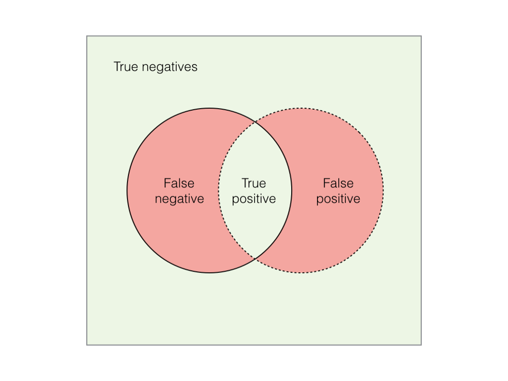

## Методы оценки качества модели



Для задачи классификации мы можем рассмотреть confusion-матрицу следующего вида:

|              | Is Obese               | Is Not Obese           |
|--------------|------------------------|------------------------|
| Is Obese     | *TP* - True Positives  | *FP* - False Positives |
| Is Not Obese | *FN* - False Negatives | *TN* - True Negatives  |

Из этой матрицы мы легко можем вывести следующие метрики:
**TPR (Specificity)** - отношение (пропорция) верно классифицированных примеров  
```python
TPR = TP / (TP + FN)
```
**FPR (1 - Specificity)** - отношение (пропорция) ошибочно классифицированных примеров   
```python
FPR = FP / (FP + TN)
```
**Accuracy** - доля правильных ответов алгоритма (отношение верно классифицированных результатов ко всем результатам).  
```python
Accurady = (TP + TN) / (TP + TN + FP + FN)
```
**Misclassification Rate (MISC)** - доля ответов с неверными классами.  
```python
MISC = 100% - Accuracy
```
**Precision** - доля объектов, названных классификатором положительными и при этом действительно являющимися положительными (ошибка первого рода - вероятность принятия неверной гипотезы)  
```python
P = (TP) / (TP + FP)
```
**Recall** (полнота) - какую долю объектов положительного класса из всех объектов положительного класса нашел алгоритм (ошибка второго рода - вероятность отвержения верной гипотезы)  
```python
R = (TP) / (TP + FN)
```
**F-мера** - среднее гармоническое presicion и recall  
(можно с различным весом учитывать точность и полноту)  
```python
F = (1 + B^2) * presicion * recall / (B^2 * presicion + recall)
```
B - вес точности в метрике  

**ROC**(Receiver Operating Characteristic curve) - кривая, позволяющая оценить качество бинарной классификации. Представляет собой график, суммирующий представление всех confusion-матриц, которые были образованы в процессе сдвига порогового значения от 0 до 1. ROC-график позволяет выбрать наиболее удовлетворяющее условиям задачи пороговое значение сигмоидальной функции.    

По оси Y отображается значение TPR - правильно классифицированных примеров  
По оси X - значение FPR - ошибочно классифицированных примеров  

**AUC**(Area Under Curve) - площадь под ROC-кривой. Мы можем построить несколько ROC-кривых для различных моделей классификации, потом посчитать для каждой ROC-кривой ее AUC и на основании этого выбрать лучшую модель.  


## Методы измерения ошибок моделей
Суть этих функций в том, что они используются прямо в процессе обучения, а не для оценки по завершению обучения. Таким образом, суть loss-функции оценить не модель в целом, а конкретный шаг обучения модели.  

Функции потерь можно разбить на два больших класса:
1. **Регрессионные**:
 - Mean Square Error / Quadratic Loss
 - Mean Absolute Error
 - Huber Loss / Smooth Mean Absolute Error
 - Log cosh Loss
 - Quantile Loss
2. **Категориальные** (классификации):
 - LogLoss
 - Focal Loss
 - KL Divergence / Relative entroty
 - Exponential Loss
 - Hinge Loss

### Регрессионные

**MSE(Mean squared error)** - показывает среднеквадратичную ошибку  
Хороша своей дифференцируемостью, плоха тем, что на выходе дает квадратичную величину, которой сложно пользоваться  
  
При наличии выбросов, они получают большее внимание (размер коррекции весов), что приводит к большему влияюнию 

**Loss function (функция потерь)** - целевая функция, которую минимизируют алгоритмы обучения.   

**L1-норма**
```python
L(y, f) = |y - f|
```
Определяет медиану, более устойчива к выбросам, менее точна  

**L2-норма**
```python
L(y, f) = (y - f)^2
```

**Quantile loss**
Больше штрафует наблюдения оказавшиеся по нужную сторону квантили  

**Logistic loss (Bernoulli loss)**
```python
L(f, y) = log(1 + exp(-2yf))

```
Наиболее часто используема в задачах бинарной классификации  
Особенность в том, что штрафуются даже корректно предсказанные метки классов  

**Adaboost loss**
```python
L(f,y) = exp(-yf)
```
Концептуально эта функция потерь очень похожа на Logistic loss, но имеет более
жесткий экспоненциальный штраф на ошибки классификации и используется реже  

**cross-entropy loss** - среднее число бит между предсказанной и истинной вероятностями 
принадлежности к классу  

```python
p - предсказанная вероятность  
q - истинная
```

**MAE Mean absolute error** - размер абсолютной ошибки
  
Данная метрика более устойчива по отношении к выбросам.  

**RMSE (Root Mean squared error)** - корень из MSE. Подходит для сравнения двух моделей или
для контроля качества во время обучения, но позволяет определить насколько хорошо модель
решает задачу.
```python
       SUM(y[i] - y[i]`)^2
SQRT(–––––––––––––––––––––––)
              l
```

**R2** - коэффициент детерминации

**SSE (sum of squared error)** 
```python
SUM(y[i] - y[i]`)^2
```


### Ссылки
 - [5 Regression Loss Functions All Machine Learners Should Know](https://heartbeat.fritz.ai/5-regression-loss-functions-all-machine-learners-should-know-4fb140e9d4b0)  
