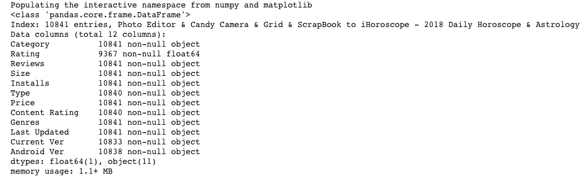
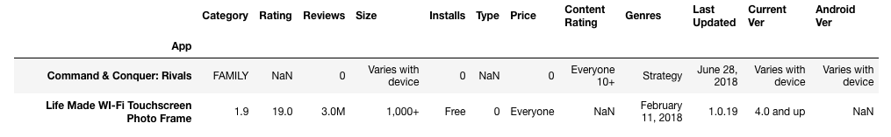

Итак, я решил попробовать свои силы на kaggle и взял первый же попавшийся dataset: https://www.kaggle.com/lava18/all-that-you-need-to-know-about-the-android-market.
Рабоать с ним будем в стандартном python-notebook (Anaconda3).
<cut />
### Загружаем данные и осматриваем
```python
import pandas as pd
playstore_data = pd.read_csv('./googleplaystore.csv', index_col="App")

playstore_data.head()
```


```python
playstore_data.info()
```


Мы видим, что поля Size, Installs, Price имеют тип object, хотя, судя по данным, должны быть числовыми. В объектный тип они сбрасываются из-за наличия нечисловых значений. Давайте изучим внимательное каждое из полей.
```python
playstore_data['Size']
```

```python
playstore_data['Size'].describe()
```


Как видим, поле Size в некоторых случаях вместо размера в мегабайтах содержит значение "Varies with device". Остальные строки визуально представляют собой паттерн: '<float>M'.
Нужно выяснить какие есть значения не подходящие под данный паттерн. Для этого есть масса способов.
```python
playstore_data[~playstore_data['Size'].str.match('^[\d\.]+M$')]
```


Отлично, теперь мы знаем, что есть записи, в которых размер хранится в килобайтах и есть записи, где вместо размера "Varies with device" (зависит от приложения). Нужно:
cвести килобайты и мегабайты к одному основанию - килобайтам и выбросить строки не подпадающие под шаблон размеров в килобайтах или мегабайтах

```python
def clean_values(v):
    if re.match('^[\d\.]+M$', v):
        return float(v[0:-1])
    elif re.match('^[\d\.]+k$', v):
        return float(v[0:-1]) / 1000
    else:
        return NaN

playstore_data['Size'] = playstore_data['Size'].map(clean_values)
```
Посмотрим теперь на поле Installs
```python
playstore_data["Installs"]
```


А теперь проверим сколько значений не удовлетворяют общему паттерну:
```python
playstore_data[~playstore_data["Installs"].str.match('^[\d\,]+\+$')]
```


Отлично, всего лишь два значения. Удалим их из нашего DataFrame-а
```python
playstore_data = playstore_data[playstore_data["Installs"].str.match('^[\d\,]+\+$')]
```
И преобразуем поле Installs к числовому типу:
```python
playstore_data["Installs"] = pd.to_numeric(playstore_data["Installs"].str.replace('\+$', '', regex=True).str.replace('\,', '', regex=True), errors="coerce", downcast='integer')
```

Посмотрим снова на наш датасет:
```python
playstore_data.info()
```


Мы видим, что поле Rating содержит значений меньше, чем остальные поля. При этом, у него тип float64. Это смахивает на то, что в нем содержатся null-ы. Проверим это:
```python
playstore_data["Rating"].isna().sum()
> 1473
```
Что ж, придется распрощаться с записями содержашими NaN. Это можно делать по колонкам:
```python
playstore_data = playstore_data[playstore_data['Rating'].notna()]
playstore_data = playstore_data[playstore_data['Size'].notna()]
playstore_data = playstore_data[playstore_data["Current Ver"].notna()]
playstore_data = playstore_data[playstore_data["Android Ver"].notna()]
```
А можно сделать и одним махом:
```python
playstore_data = playstore_data.dropna()
```
Отлично, мы избавились от всех пустых значений:


Однако колонка Reviews имеет тип object. Надо привести ее к числу:
```python
playstore_data["Reviews"] = playstore_data["Reviews"].astype(int)
```

Теперь полный порядок, можно начинать строить графики.
