# Анализ данных на основе графиков

Посмотрим еще раз на наши данные:
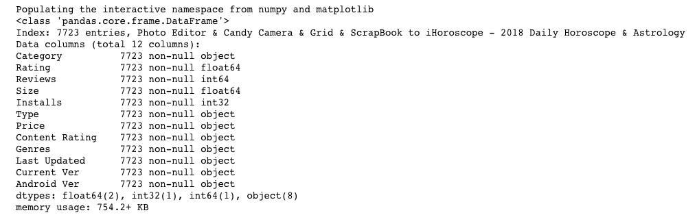

Мы видим здесь 4 числовые колонки. Построим по ним гистограммы.

```python
playstore_data['Size'].iplot(
    kind="hist",
    bins=500,
    xTitle="Size",
    linecolor="black",
    yTitle="count",
    title="Size distribution"
)
```

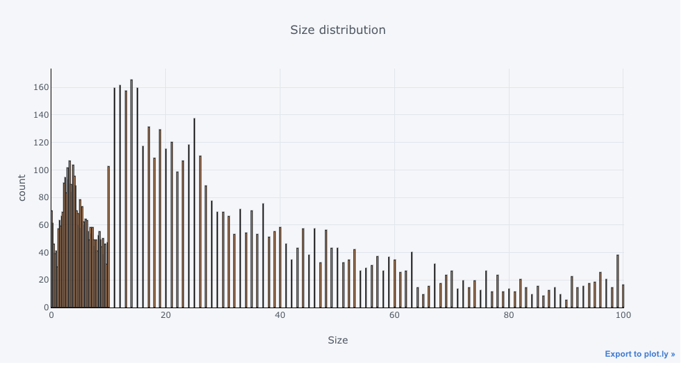

```python
playstore_data['Reviews'].iplot(
    kind="hist",
    bins=500,
    xTitle="Reviews",
    linecolor="black",
    yTitle="count",
    title="Reviews distribution"
)
```

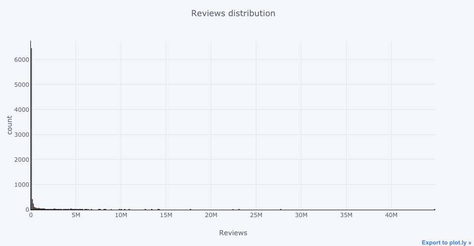

```python
playstore_data['Reviews'].iplot(
    kind="hist",
    bins=50,
    xTitle="Reviews",
    linecolor="black",
    yTitle="count",
    title="Reviews distribution"
)
```

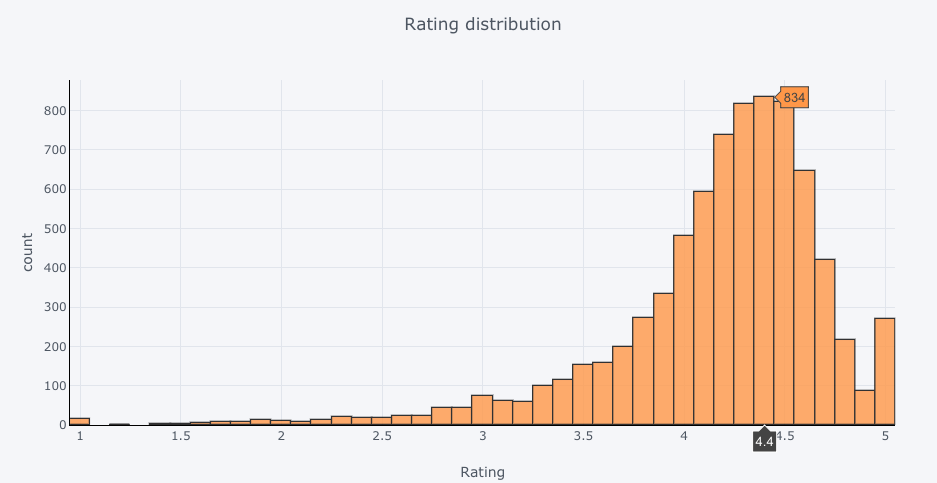

```python
playstore_data['Installs'].iplot(
    kind="hist",
    bins=50,
    xTitle="Installs",
    linecolor="black",
    yTitle="count",
    title="Installs distribution"
)
```

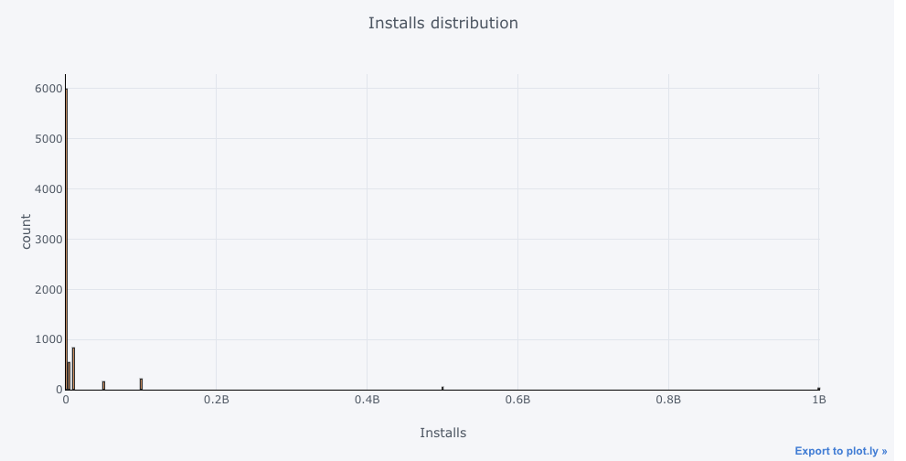

- этот график выглядит ужасно подозрительно. Кажется, что здесь очень много дублей.
Проверим это:
```python
playstore_data["Installs"].nunique()
> 19
```

Действительно, уникальных значений здесь оказалось всего 19.
Посмотрим теперь на количества установок и количество категорий в каждой группе установок:
```python
playstore_data.groupby('Installs').agg({'Category': 'count'})
```

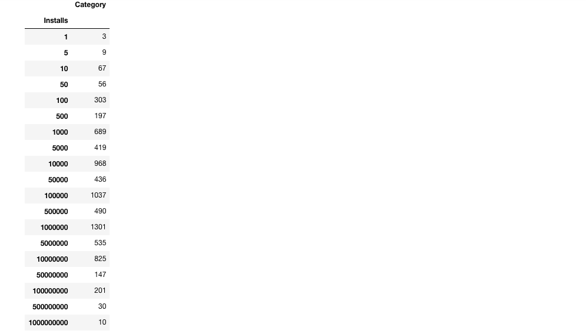

Смотреть на это в виде графика не столь удобно, поскольку цифры очень разнятся.

А теперь посмотрим на наиболее популярные приложения (с наибольшим количеством инсталляций и наибольшим рейтингом):
```python
playstore_data.sort_values(by=["Rating", "Installs"], ascending=False)
```
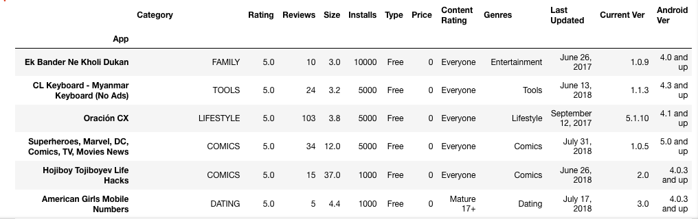


А теперь построим график, показывающий количество приложений в каждой из категорий
```python
playstore_data.groupby('Category').count()['Size'].iplot(
    kind="bar",
    yTitle="Number apps",
    linecolor="black",
    title="Apps by category"
)
```
(вместо Size можно использовать любую числовую колонку)
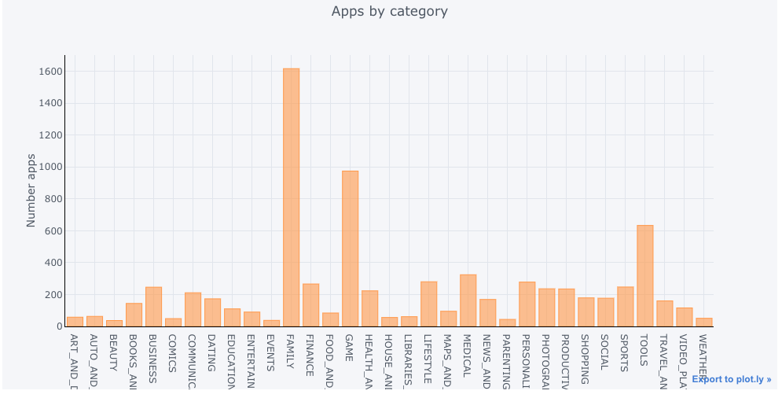


Количество приложений в каждом жанре
```python
playstore_data.groupby('Genres').count()['Size'].iplot(
    kind="bar",
    yTitle="Number genres",
    linecolor="black",
    title="Apps by genre"
)
```
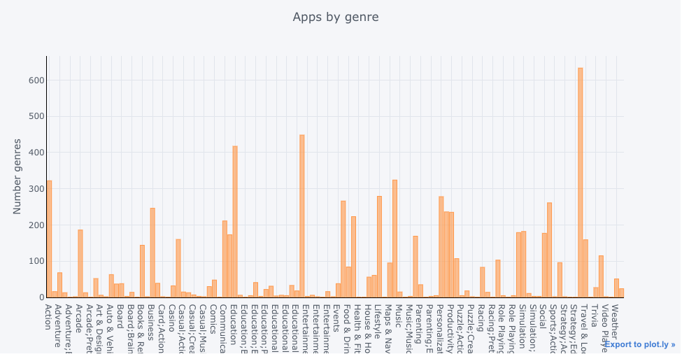


Посмотрим на соотношение платных приложений и бесплатных
```python
playstore_data.groupby('Type', as_index=False).count().iplot(
    kind='pie',
    labels="Type",
    values="Category"
)
```
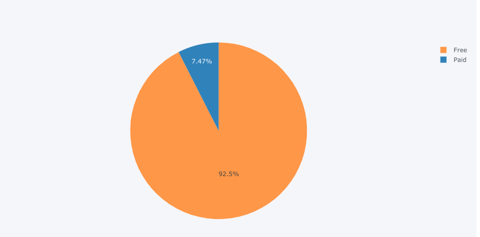


Посмотрим на диаграмму распределения версий ОС android по аудитории
```python
android_ver_stat = playstore_data.groupby('Android Ver', as_index=False)["Category"].count()
android_ver_stat = android_ver_stat[android_ver_stat["Category"] > 100].sort_values(by="Category")
android_ver_stat.iplot(
    kind='pie',
    labels="Android Ver",
    values="Category"
)
```
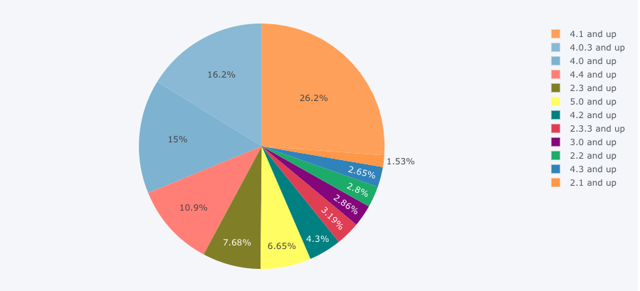

