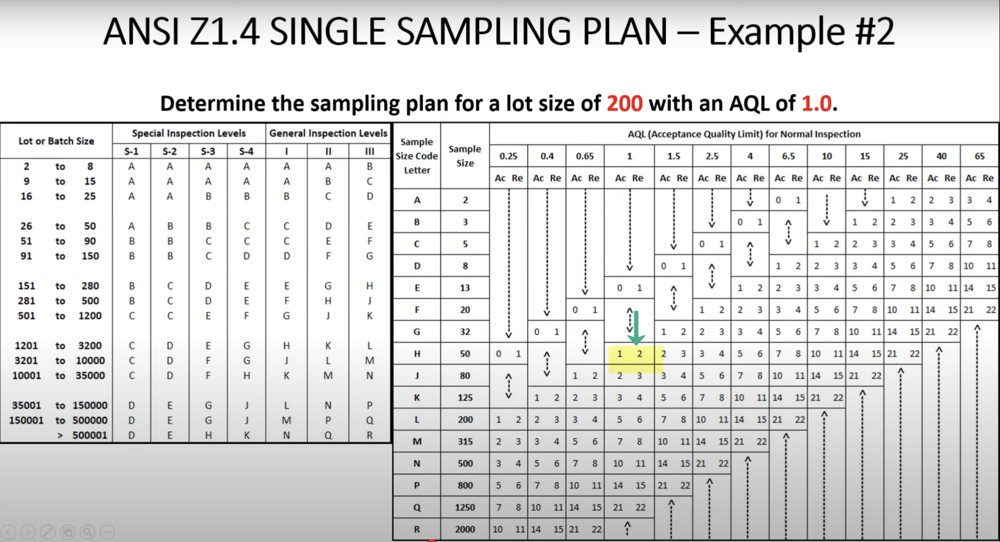
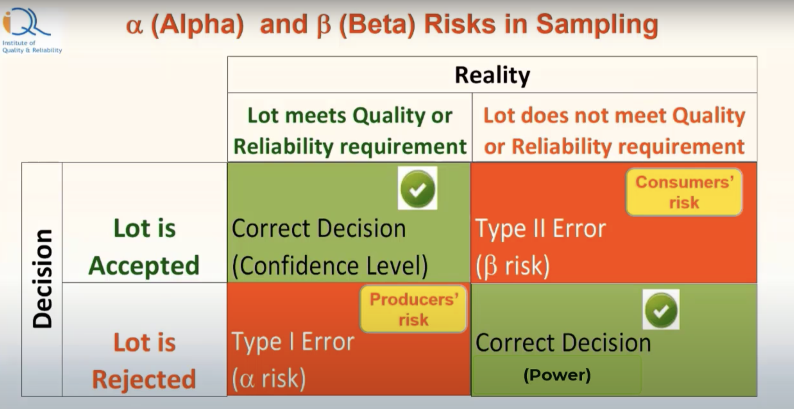

# Defects detection task

**Acceptance sampling** - a practice where we taks a sample from a population, test it and decide: accept or reject the entire population (lot) basing on the test results of the sample.  

**AQL** - Acceptance Quality Level - worst tolerable amount of defects.  

There is a ready to use table, that can be used for choosing a sample size basing on 2 parameters:
 - size of the entire batch  
 - AQL  

The algorithm is next:
 - you choose the line in the first table  
 - then you should choose an appropriate line in the second table. First value and below - batch is accepted, second value or above - batch should be rejected  

Results of conducting a sampling experiment can be shown as a table:

### Risks of Acceptance sampling

