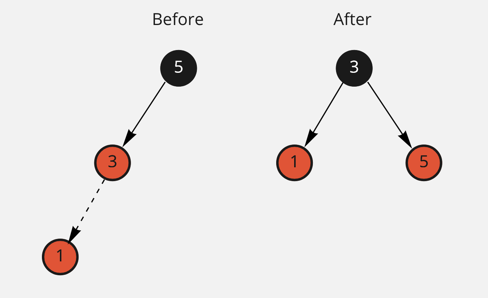

# Red-Black-Tree

**Red-Black-Tree** - is a subtype of a binary search tree with additional constraints.
Here these constraints:
 - all nodes are black or red
 - root is always black
 - red nodes have always black children
 - leaves are always black
 - path to any leave has equal black length

When we add a new node, we always add it on the leave position with red color.
After that we need to fix insertion operation and rebalance our tree.
For it we can do the next operations:
 - recolor nodes  
 - rotate nodes (left and right rotation)  

Rotation rules:


(in all examples I'm going to hide all empty black leaves.)  

Let's consider few cases:

#### Case 1
Adding new node to the root.


Here we just add new node as child node and leave it with red color.  

#### Case 2

Here we can see, that we need to do right rotation to get a valid tree.  

#### Case 3

Here we can see, that parent's neighbour (uncle) has red color and the only thing that we need to do here - recolor parent and uncle from red color to black.  

#### Case 4

Here we can see that to become to the end state, we need do execute two operations:
 - rotate right  parent node
 - rotate left grandparent node

All these operation help us to keep tree in a valid condition.

*TODO: remove*

### Development
To run tests:
```bash
source .venv/bin/activate
pytest .
```

### Links
 - [link 1](https://neerc.ifmo.ru/wiki/index.php?title=%D0%9A%D1%80%D0%B0%D1%81%D0%BD%D0%BE-%D1%87%D0%B5%D1%80%D0%BD%D0%BE%D0%B5_%D0%B4%D0%B5%D1%80%D0%B5%D0%B2%D0%BE)  
 - [link 2](https://ru.wikipedia.org/wiki/%D0%9A%D1%80%D0%B0%D1%81%D0%BD%D0%BE-%D1%87%D1%91%D1%80%D0%BD%D0%BE%D0%B5_%D0%B4%D0%B5%D1%80%D0%B5%D0%B2%D0%BE)  
 - [link 3](https://favtutor.com/blogs/red-black-tree-python#:~:text=What%20is%20a%20Red%2DBlack%20Tree%3F,specifically%2C%20either%20red%20or%20black.)  
 - [link 4](https://www.programiz.com/dsa/red-black-tree)  
